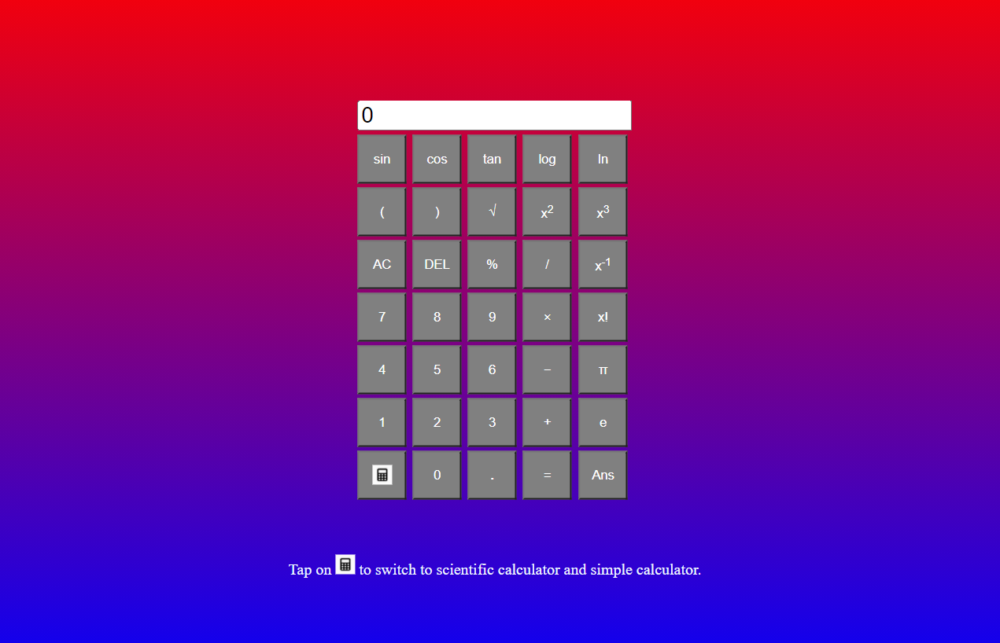
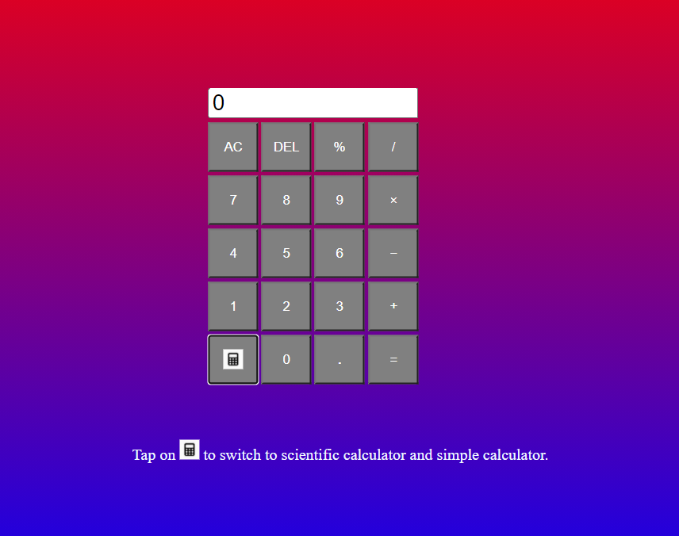

# Scientific Calculator

#### This is a hobby project. This calculator is made using HTML CSS and JavaScript.

#### It has a toggle button to switch between scientific and simple calculator.

[Click Here](https://srivatsajoshi.github.io/ScientificCalculator)

